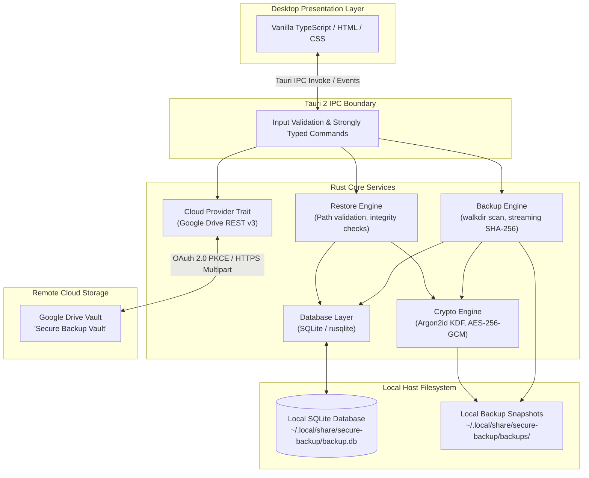
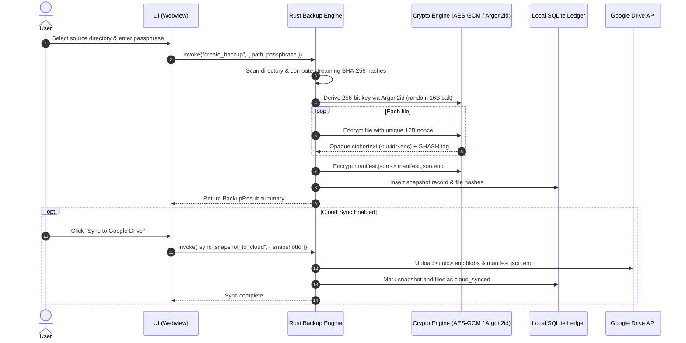
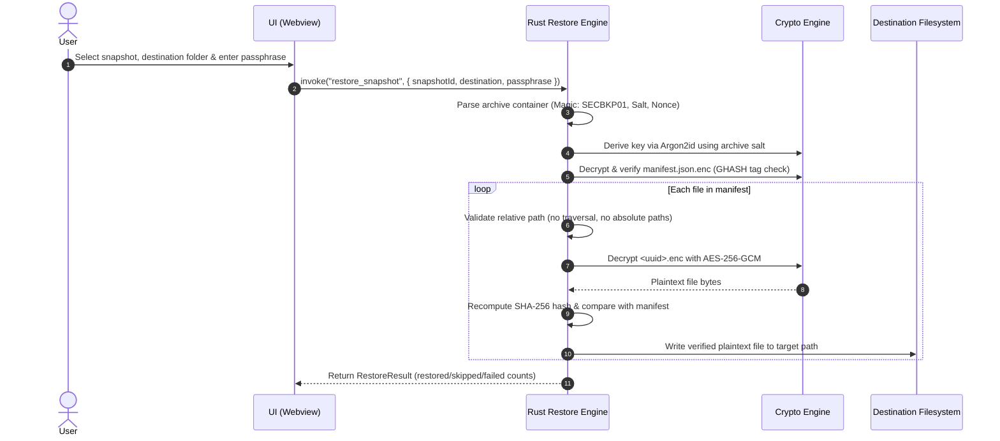
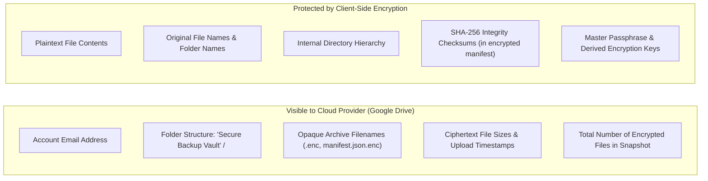
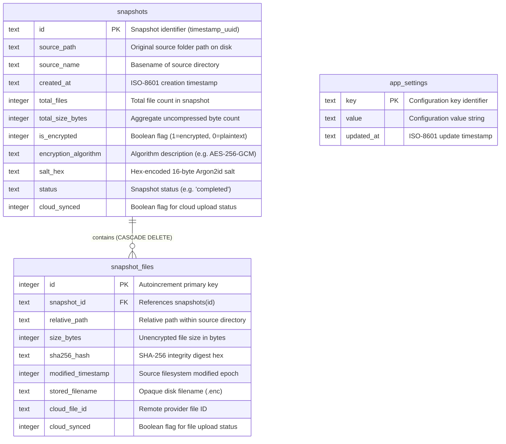

# Secure Backup

[](https://github.com/abdulwalidal/secure-backup/actions/workflows/ci.yml)
[](LICENSE)
[](https://www.rust-lang.org/)
[](https://tauri.app/)

A lightweight desktop backup application built with Rust and Tauri 2. Secure Backup performs client-side authenticated encryption (AES-256-GCM + Argon2id) on your files and directories before storage and optional synchronization to cloud providers such as Google Drive.

> [!WARNING]
> **Early Development Notice**
> Secure Backup is in active early development and has not undergone an independent third-party security audit. Always maintain independent secondary backups of critical data, and do not rely on Secure Backup as your sole backup solution.

---

## Table of Contents

- [Key Features](#key-features)
- [System Architecture](#system-architecture)
- [How It Works](#how-it-works)
  - [Backup Data Flow](#backup-data-flow)
  - [Restore Data Flow](#restore-data-flow)
- [Security Model](#security-model)
  - [Cryptographic Scheme](#cryptographic-scheme)
  - [Cloud Privacy & Metadata Exposure](#cloud-privacy--metadata-exposure)
  - [Security Considerations & Limitations](#security-considerations--limitations)
- [Local Database Schema](#local-database-schema)
- [Supported Platforms](#supported-platforms)
- [Installation & Getting Started](#installation--getting-started)
- [Basic Workflow](#basic-workflow)
- [Disaster Recovery & Restore](#disaster-recovery--restore)
- [Development & Testing](#development--testing)
- [Contributing](#contributing)
- [Roadmap](#roadmap)
- [Security Reporting](#security-reporting)
- [License](#license)

---

## Key Features

- **Client-Side Authenticated Encryption**: Files and manifests are encrypted locally using AES-256-GCM with unique 96-bit nonces. Encryption keys are derived using Argon2id with cryptographically random 128-bit salts.
- **Privacy-Preserving Cloud Storage**: Encrypted snapshots are stored in cloud vaults using opaque UUID-based filenames (`<uuid>.enc`). Cloud-stored manifests (`manifest.json.enc`) are encrypted so directory structures and original file paths remain confidential.
- **Cryptographic Tamper Detection**: Every file is fingerprinted with streaming SHA-256 digests prior to encryption. During restoration, integrity digests are checked against the decrypted contents, and AES-256-GCM GHASH tags ensure any corrupted or altered ciphertext is rejected.
- **Google Drive Integration**: Connects via OAuth 2.0 PKCE using a local loopback listener. Files are uploaded directly to a dedicated `"Secure Backup Vault"` folder via Google Drive REST API v3 multipart uploads.
- **Full Restoration & Catalog Reconstruction**: Restore entire snapshots or recover catalogs from cloud manifests onto fresh installs, complete with strict path-traversal prevention.
- **High-Entropy Key Generator**: Includes a client-side CSPRNG-powered passphrase generator to create 256-bit entropy keys.
- **Embedded Local Ledger**: Powered by an embedded SQLite database (`rusqlite`) for fast, zero-configuration local indexing of snapshots, file hashes, and synchronization states.
- **Resource Efficient**: Native Rust core with minimal memory footprint, avoiding resource-heavy browser runtimes.

---

## System Architecture

The following diagram illustrates the relationship between the desktop presentation layer, Tauri IPC security boundary, native Rust services, local storage, and remote cloud infrastructure:



For detailed component descriptions, see [ARCHITECTURE.md](ARCHITECTURE.md).

---

## How It Works

### Backup Data Flow

When initiating an encrypted backup, the source files are processed strictly in local memory and filesystem storage before any network transfer takes place:



### Restore Data Flow

Restoring a snapshot decrypts files into a target destination, verifying authenticity and cryptographic integrity at each step:



---

## Security Model

### Cryptographic Scheme

Secure Backup employs standard, authenticated cryptographic algorithms without proprietary extensions:

| Primitive | Specification | Purpose | Parameters |
| :--- | :--- | :--- | :--- |
| **KDF** | Argon2id (v0x13) | Key derivation from passphrase | 19 MiB memory, 2 iterations, 1 lane, 16-byte random OS salt |
| **Cipher** | AES-256-GCM | Authenticated symmetric encryption | 256-bit key, 12-byte random OS nonce per file |
| **Integrity Tag** | GHASH (NIST SP 800-38D) | Ciphertext authenticity & tamper check | 16-byte authentication tag appended to ciphertext |
| **Digest** | SHA-256 | Pre-encryption file integrity | Streaming 64 KB memory-buffered hashing (`sha2`) |
| **RNG** | OS CSPRNG | Salt, nonce, and key generation | Operating system entropy via `rand::rngs::OsRng` |

#### Binary Container Format (`SECBKP01`)

Encrypted files and encrypted manifests are packaged into a binary format:

```text
+----------------------+--------------------+--------------------+-------------------------------+
| Magic Header         | Salt               | Nonce              | Ciphertext + GHASH Tag        |
| 8 Bytes ("SECBKP01") | 16 Bytes (OS RNG)  | 12 Bytes (OS RNG)  | Variable Length (AES-256-GCM) |
+----------------------+--------------------+--------------------+-------------------------------+
```

If any bit of the header, salt, nonce, ciphertext, or authentication tag is modified, AES-256-GCM decryption fails immediately and no output file is written.

### Cloud Privacy & Metadata Exposure

To evaluate the privacy guarantees of cloud synchronization, the following table and diagram distinguish what Google Drive can observe versus what remains protected:



| Data Item | Transmitted State | Visibility to Cloud Provider |
| :--- | :--- | :--- |
| **File Contents** | Encrypted (`AES-256-GCM`) | **Protected**: Provider sees only encrypted bytes. |
| **Original File Names** | Encrypted inside `manifest.json.enc` | **Protected**: Cloud files are named `<uuid>.enc`. |
| **Directory Structure** | Encrypted inside `manifest.json.enc` | **Protected**: Cloud files are stored in a flat snapshot folder. |
| **File Sizes** | Ciphertext byte length | **Visible**: Ciphertext size reflects plaintext length plus 44-byte container overhead. |
| **Snapshot ID** | Plaintext folder name (e.g. `20261003_190000_<uuid>`) | **Visible**: Contains timestamp and random UUID. |
| **Account Email** | OAuth 2.0 user profile | **Visible**: User Google account email associated with tokens. |

### Security Considerations & Limitations

- **Passphrase Responsibility**: Passphrases are not escrowed, saved to disk, or sent across any network. If you lose your passphrase, encrypted backups cannot be recovered.
- **Local Host Security**: Secure Backup does not protect against malware, keyloggers, or unauthorized users with root/administrator access on the local host machine.
- **File Size Leakage**: AES-GCM preserves the approximate size of the underlying data (ciphertext length equals plaintext length plus tag and container headers). Traffic analysis or size analysis may reveal clues about stored file types.
- **Local Token Storage**: Google Drive OAuth refresh tokens are stored in the local SQLite database (`~/.local/share/secure-backup/backup.db`). Restrict local machine access to protect these credentials.
- **Unencrypted Backups Option**: The application supports taking local unencrypted backups if no passphrase is provided. These snapshots do not have metadata or content protection.

For full disclosure and threat modeling, refer to [SECURITY.md](SECURITY.md).

---

## Local Database Schema

Secure Backup uses an embedded SQLite database (`backup.db`) located in the user local data directory (`~/.local/share/secure-backup/`). The schema manages snapshot metadata, file indexes, and cloud synchronization states:



---

## Supported Platforms

Secure Backup is engineered for desktop operating systems using Tauri 2:

| Platform | Webview Technology | Minimum OS Version | Status |
| :--- | :--- | :--- | :--- |
| **Linux** (x86_64) | WebKitGTK (`libwebkit2gtk-4.1`) | Ubuntu 22.04+, Debian 12+, Fedora 38+ | Tier 1 (Fully Supported) |
| **Windows** (x86_64) | Microsoft WebView2 | Windows 10 (1809+) / Windows 11 | Tier 1 (Supported via Tauri 2) |
| **macOS** | Apple WebKit (WKWebView) | macOS 11+ Big Sur | Planned |

---

## Installation & Getting Started

### Prerequisites

- **Rust**: `1.78.0` or higher (`curl --proto '=https' --tlsv1.2 -sSf https://sh.rustup.rs | sh`)
- **Node.js**: `v18.0.0` or higher
- **Linux System Libraries** (Debian/Ubuntu):
  ```bash
  sudo apt update && sudo apt install -y \
    build-essential \
    curl \
    wget \
    file \
    libssl-dev \
    libgtk-3-dev \
    libwebkit2gtk-4.1-dev \
    libappindicator3-dev \
    librsvg2-dev
  ```

### Build from Source

1. Clone the repository:
   ```bash
   git clone https://github.com/abdulwalidal/secure-backup.git
   cd secure-backup
   ```

2. Install frontend dependencies:
   ```bash
   npm install
   ```

3. Run in development mode:
   ```bash
   npm run tauri dev
   ```

4. Build a production bundle:
   ```bash
   npm run tauri build
   ```
   Installers (`.deb`, `.AppImage` on Linux) will be generated in `src-tauri/target/release/bundle/`.

---

## Basic Workflow

1. **Select Source Directory**: Click **Select Folder** on the Dashboard and choose the folder you wish to back up.
2. **Enter or Generate Passphrase**: Provide a strong master passphrase, or click **Generate Secure Key** to generate a 256-bit passphrase.
3. **Run Backup**: Click **Start Encrypted Backup**. The files are scanned, fingerprinted with SHA-256, encrypted with AES-256-GCM, and recorded in your local SQLite ledger.
4. **Cloud Synchronization (Optional)**:
   - Navigate to **Settings** and connect your Google Drive account via OAuth 2.0 PKCE.
   - Go to **Backup History** and click **Sync to Google Drive** on any completed snapshot.

---

## Disaster Recovery & Restore

1. **Local Restore**:
   - In **Backup History**, click **Restore** on any snapshot.
   - Select a destination folder and input the master passphrase.
   - The engine validates file paths, decrypts AES-256-GCM ciphertexts, and verifies SHA-256 fingerprints before restoring each file.

2. **Cloud Disaster Recovery (Fresh Machine)**:
   - On a fresh installation with an empty database, navigate to the **Restore** tab.
   - Connect Google Drive and click **Scan Cloud**.
   - Click **Rebuild Local Catalog** to import encrypted snapshot manifests from your remote vault.
   - Restore your files directly to your chosen target directory.

---

## Development & Testing

Run automated unit and integration tests across the Rust core:

```bash
# Run all Rust backend tests
cargo test --manifest-path src-tauri/Cargo.toml

# Check code formatting
cargo fmt --all --manifest-path src-tauri/Cargo.toml -- --check

# Run linter checks
cargo clippy --manifest-path src-tauri/Cargo.toml --all-targets -- -D warnings

# Build and validate frontend TypeScript
npm run build
```

---

## Contributing

Contributions are welcome. Please read [CONTRIBUTING.md](CONTRIBUTING.md) for details on our code of conduct, development standards, and pull request procedures.

---

## Roadmap

A structured overview of completed phases and upcoming capabilities (including incremental backups and automated scheduling) is maintained in [ROADMAP.md](ROADMAP.md).

---

## Security Reporting

If you identify a security vulnerability, please review [SECURITY.md](SECURITY.md) and report it privately via GitHub Security Advisories or direct maintainer contact. Please do not open public issues disclosing vulnerabilities.

---

## License

This project is licensed under the [MIT License](LICENSE).
